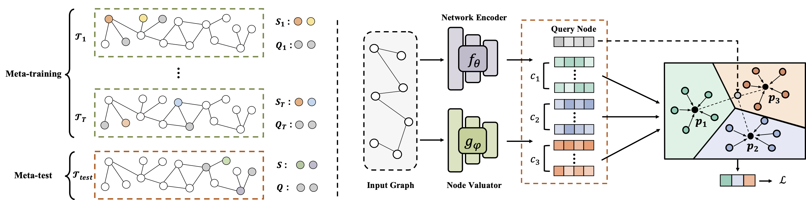

Graph Prototypical Networks for Few-shot Learning on Attributed Networks (CIKM2020)
============

## Graph Prototypical Networks (GPN)

This is the source code of paper ["Graph Prototypical Networks for Few-shot Learning on Attributed Networks"](https://arxiv.org/pdf/2006.12739.pdf).


## Requirements
python==3.6.6 

torch==1.4.0

## Usage
```python train_gpn.py --shot 5 --way 5 --episodes 1000 --dataset dblp --dropout 0.5 --use_cuda```

## Citation

Please cite our paper if you use this code in your own work:

```
@inproceedings{ding2020graph,
  title={Graph prototypical networks for few-shot learning on attributed networks},
  author={Ding, Kaize and Wang, Jianling and Li, Jundong and Shu, Kai and Liu, Chenghao and Liu, Huan},
  booktitle={Proceedings of the 29th ACM International Conference on Information \& Knowledge Management},
  pages={295--304},
  year={2020}
}
```


